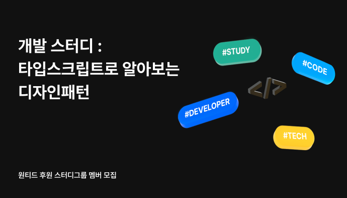

# 타입스크립트로 알아보는 디자인 패턴



## 📏 진행 일정

- 매주 월요일 21시
  - 10월 24일 ~ 12월 12일 (8회)
- 매주 1개의 디자인 패턴 발표
  - 1회 OT + 7회 발표
- 스터디 원 — 총 8명

<br/>

## 진행 방식 (발표형)

- 순서를 정해서 일주일에 한번씩 `README.md`에 정리하고 발표
  - 인당 1회 발표
    (발표 진행에 어려움을 겪는다면 1주일 전에 스터디장에게 연락주세요)
- 매주 읽은 챕터에 대한 퀴즈를 **1개** 준비해주세요.

  - Issue에 Comment로 퀴즈를 남겨주세요 :)
  - OX, 객관식, 주관식 상관없이 자유롭게 만들어주세요.
    [**퀴즈 마크업 템플릿]\*\*

  ```markdown
  ### 아이템 N

  퀴즈 내용 객관식의 정답을 골라보세요!
  (퀴즈 내용)

  1. 1번
  2. 2번
  3. 3번

  <details>
  <summary>퀴즈 정답</summary>
  <div markdown="1">    
  정답은 1번!
  </div>
  </details>
  ```

아래 게더에서 진행합니다.
(추가 예정)

<br/>

## 🗣 발표 관련

### 발표 준비하기

- 발표 자료를 md, 노션, 블로그, ppt 등 자유형식으로 준비해주세요.
- 발표 주차에 해당하는 폴더 `README.md` 에 준비한 자료를 PR해주세요.
  → 블로그, 노션의 경우 md에 링크만 남겨도 괜찮습니다 :)

### 발표 진행하기

- 내용을 요약 및 정리하여 발표해주세요. (10~30분+)
  - 내가 이해한 버전으로 다른 사람에게 설명 할 수 있으면 돼요.
- QnA 시간 (10분+) - 발표 내용에 대해 다른 사람들과 질의 문답하는 시간이에요.

### 발표 순서

제비뽑기 (10/24 OT에 진행 예정)

## 🔗 스터디 관련 링크

[Study 노션](https://economic-brace-cb7.notion.site/f6872a0f75e14dba9b54cef48c326735)
